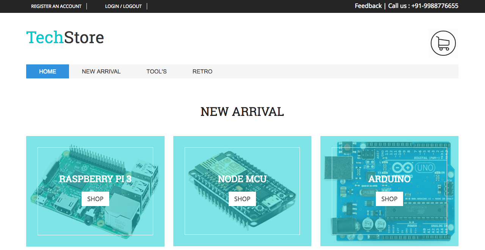

# TechStore - Ecommerce Website
TechStore is an Ecommerce Website based on PHP and Bootstrap. There are Some Cool 
Gadgets for Sale on this Website such as Raspberry pi and Old Apple Macintosh.

#Programming Languages 
1. PHP
2. CSS
3. jQuery
4. Java Script
5. Bootstrap

## Must Visit For Live Demo

### LINK: http://project67.000webhostapp.com 

Configuration of Website - TechStore

Software’s
1. Xampp                 
2.Text Editor ( Sublime text or VC resist )

Server type: MariaDB
Web Server:  Apache
PHP version: 7.0.26
Server charset: UTF-8 Unicode (utf8)
PHP extension: mysqli, curl, mbstring

